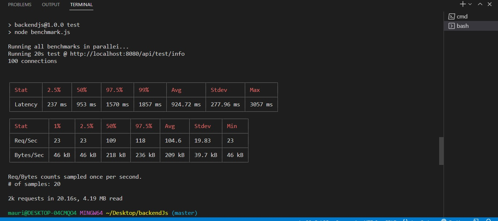
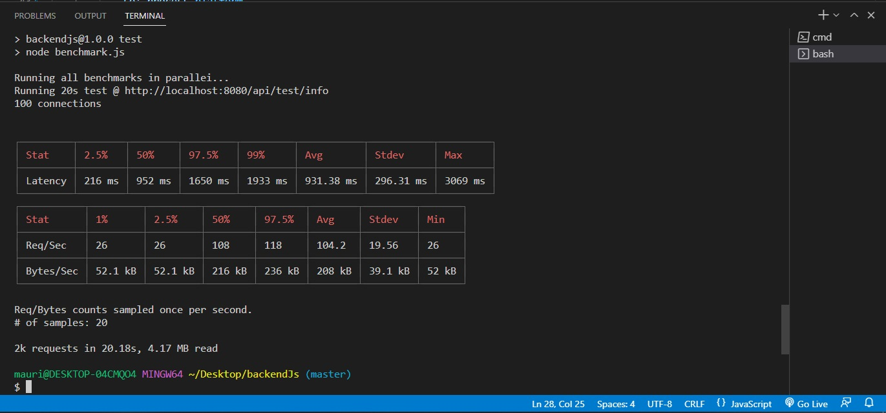
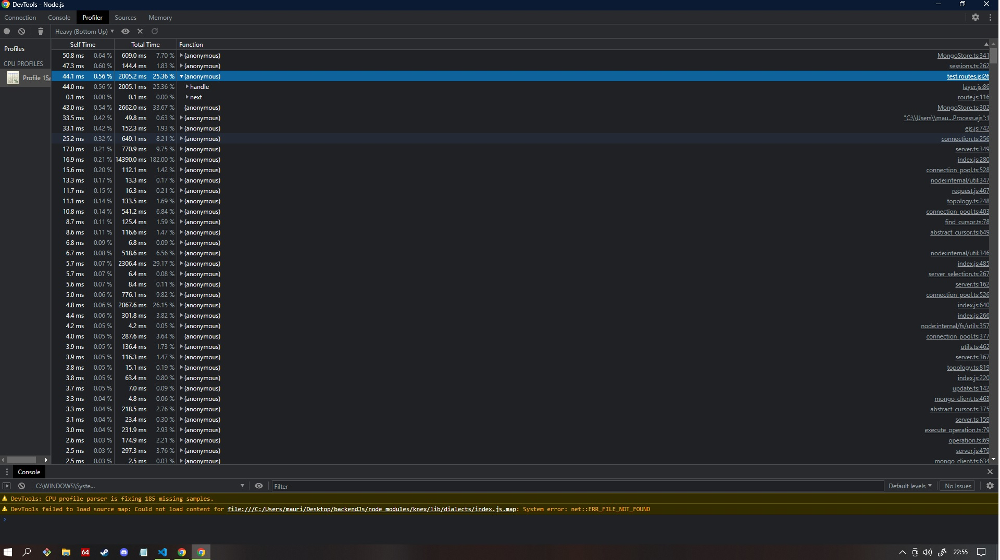
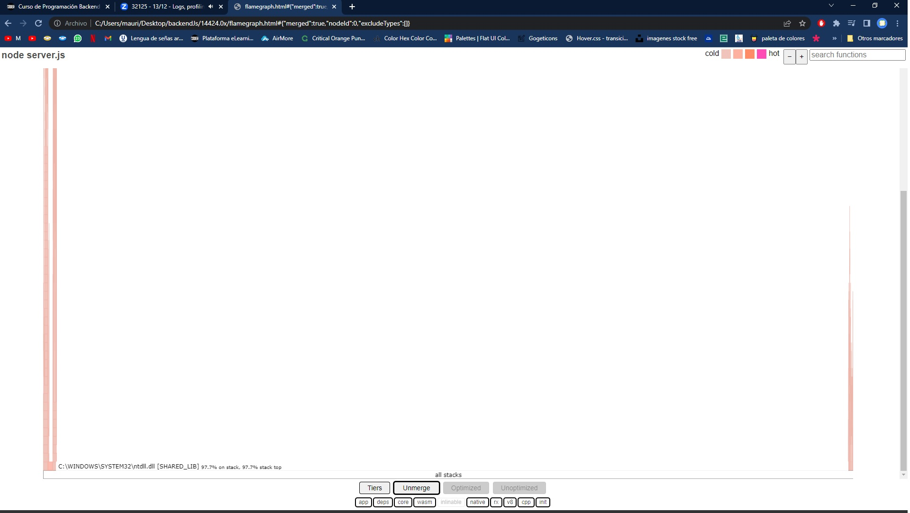
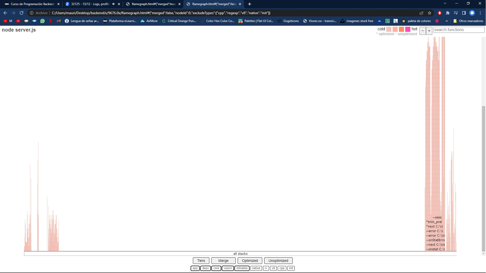

# 1- Profiling con Artillery y Autocannon

- Test a la ruta "/info" con Autocannon con console.log

- Test a la ruta "/info" con Autocannon sin console.log

## --------------------------------------------------------------------------------------

# 2- Profiling utilizando modo inspector.

- Test a la ruta "/info" en modo inspector con console.log

- Test a la ruta "/info" en modo inspector sin console.log

## --------------------------------------------------------------------------------------

# 3- Diagrama de flama con 0x y Autocannon.

- Diagrama de flama de la ruta "/info" con console.log

- Diagrama de flama de la ruta "/info" con console.log

